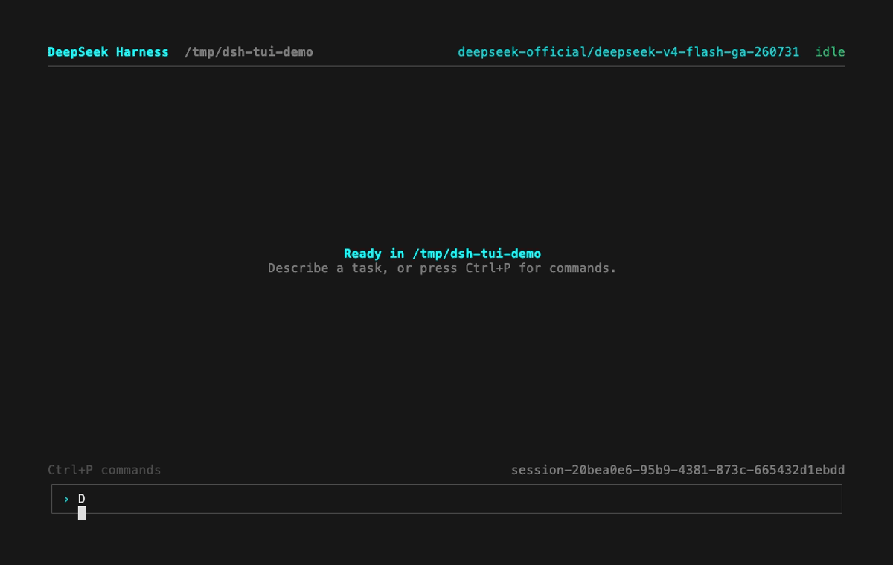
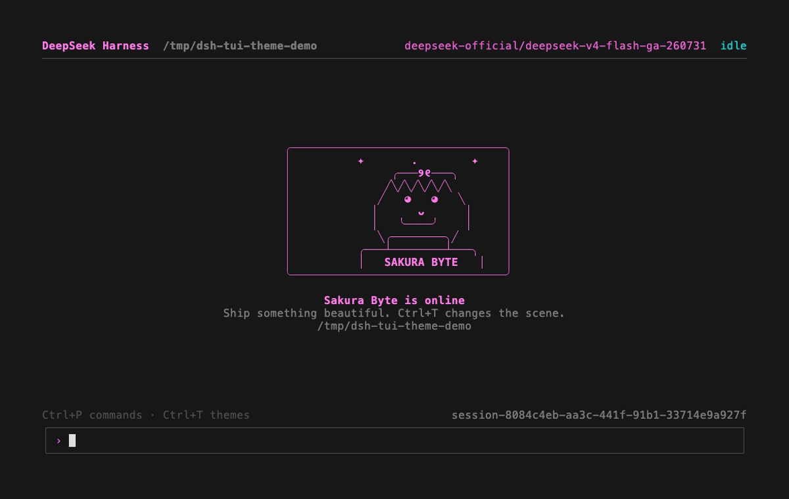

<div align="center">

# DeepSeek Harness TUI

**为终端深度用户打造的生产级 AI coding agent（编程智能体）。**

[English](README.md)

[](package.json) [](packages/bundle/tui-app/README.md) [](packages/bundle/tui-app/README.md) [](packages/bundle/tui-app/README.md) [](LICENSE)

通过真实 Harness runtime 运行 DeepSeek、火山方舟或任意 OpenAI 兼容模型，并获得流式工具、审批控制、持久化 Session 与可切换主题。

</div>



## 为真实工作而生

DeepSeek Harness TUI 是完整的编码工作空间，而不是终端里的聊天框。你可以让它检查仓库、编辑文件、运行命令并通过多轮交互完成任务，同时实时监督工具调用、diff、审批和失败。

TUI 与 Agent、Session、工具、命令和持久化服务运行在同一个插件组合 Host 中。你与 runtime 之间没有浏览器、localhost bridge 或功能缩水的 agent 实现。

- **真实编码工作流**：多轮 Session、实时 steering（中途引导）、取消、工具、diff、Todo 进度、命令、审批和结构化问题。
- **持久性内建**：已结算输出从权威 Session 日志投影；关闭终端后仍可恢复工作。
- **透明但聚焦**：工具操作与失败始终可见，原始 reasoning 和内部 runtime context 保持折叠。
- **终端原生**：Unicode 编辑、多行输入、粘贴、历史、transcript（文本记录）分页、窄窗格、`NO_COLOR`、ASCII 降级和可靠终端恢复。
- **提供方灵活**：使用 DeepSeek、火山方舟、OpenAI 兼容 gateway，或 Harness 模型 registry 支持的任意提供方。
- **跨平台**：支持 macOS、Linux、Windows Terminal、SSH、tmux 和其他兼容 VT 的终端。

<a id="run"></a>

## 快速开始

前置条件：Node.js `^22.19` 或 `>=24`，以及模型提供方凭据。

```sh
export DEEPSEEK_API_KEY="your-key"
npx --yes deepseek-harness-tui@latest
```

当前目录会成为 workspace。npx launcher 会转发全部 TUI 参数：

```sh
npx --yes deepseek-harness-tui@latest --cwd ../your-project
npx --yes deepseek-harness-tui@latest --model deepseek-official/deepseek-v4-flash
npx --yes deepseek-harness-tui@latest --resume <session-id>
npx --yes deepseek-harness-tui@latest --theme sakura
```

全局安装方式如下：

```sh
npm install --global deepseek-harness-tui@latest
dsh-tui --theme sakura
```

<a id="run-from-source"></a>

### 从源码运行

源码开发需要 pnpm：

```sh
git clone https://github.com/liang7878/deepseek-harness-tui.git
cd deepseek-harness-tui
pnpm install
pnpm run build

export DEEPSEEK_API_KEY="your-key"
pnpm dsh tui
```

## MaaS 服务

在 `~/.dsh/settings.yaml` 中添加 OpenAI 兼容路由。base URL 截止到 `/api/v3`；适配器会追加请求路径。

```yaml
llm-pi-ai:
  providers:
    volcengine:
      displayName: Volcengine Ark
      apiKeyEnv: ARK_API_KEY
      api: openai-completions
      baseURL: https://ark.cn-beijing.volces.com/api/v3
      models:
        - id: your-endpoint-or-model-id
```

```sh
export ARK_API_KEY="your-key"
npx --yes deepseek-harness-tui@latest --model volcengine/your-endpoint-or-model-id
```

机密只保存在环境变量或 Harness 凭据存储中；settings 仅包含凭据引用。

[模型配置指南](docs/user/guide/providers.md#maas-configuration-recipes)提供火山方舟、SiliconFlow、OpenRouter、阿里云百炼、Together AI 和 Fireworks AI 的可直接复制示例。

## 主题



按 `Ctrl+T` 或运行 `/theme`，即可在 **Classic Cyan**、**Sakura Byte**、**Deep Ocean** 和 **Ember Forge** 之间切换。选择器会将你的选择持久化到 `~/.dsh/settings.yaml`；`--theme <id>` 仅覆盖当前一次运行。Sakura Byte 使用专为本项目创作的原创动漫风欢迎画布，不引用现有角色或作品 IP。

自定义主题从同一 settings 文件加载，支持经过校验的语义色、欢迎文案和可选字符画。完整示例见[主题配置约定](packages/bundle/tui-app/README.md#themes)。装饰画布只在空 transcript、宽窗口且支持颜色与 Unicode 的终端中显示；窄窗格、`NO_COLOR`、`--no-unicode` 和活动 transcript 始终保留紧凑的生产布局。

## 键盘工作流

| 按键 | 操作 |
|---|---|
| `Enter` | 发送后续消息，或 steering 正在运行的 Agent。 |
| `Ctrl+J` | 插入换行。 |
| `Ctrl+C` | 取消活动工作；idle 时退出。 |
| `Ctrl+O` | 浏览持久化 Session。 |
| `Ctrl+L` | 选择提供方和模型。 |
| `Ctrl+T` | 选择并持久化终端主题。 |
| `Ctrl+P` | 浏览命令。 |
| `PageUp` / `PageDown` | 翻阅 transcript。 |
| `Ctrl+E` | 返回实时末尾。 |
| `Esc` | 关闭或取消当前交互。 |

本地命令包括 `/new`、`/resume`、`/sessions`、`/model`、`/models`、`/theme`、`/themes`、`/commands`、`/help` 与 `/quit`。插件贡献的 slash command 会出现在同一个命令面板中。

## 架构

DeepSeek Harness 构建于 [Cordis](https://github.com/cordiverse/cordis)：**一切皆插件**。TUI 是叠加在 `dsh-base` 上的第一方 profile，而不是 agent loop（智能体循环）的 fork。它直接消费公开服务，只增加一个由 Host 持有的展示层：

```text
dsh tui
  └─ profile: dsh-base + dsh-tui-app
       ├─ Agent / Session / model registry
       ├─ tools / commands / approvals / questions
       ├─ persistence / sandbox / shell / filesystem
       └─ Ink renderer + TUI controller
```

请阅读 [TUI 包约定](packages/bundle/tui-app/README.md)、[产品规范](apps/cli/PRODUCT.md)、[交互设计](apps/cli/DESIGN.md)和 [Harness 架构](docs/architecture.md)。

## 质量

发布路径会执行定向单元与集成测试、真实 Loader 组合、带 Unicode 输入的真实伪终端进程、终端状态恢复、TypeScript strict mode、lint、包 hygiene、文档同步和构建后 profile smoke。上方动图由真实应用与火山方舟模型链路录制。

## 项目状态

本仓库基于预发布阶段的 DeepSeek Harness 代码库，维护面向生产的 TUI 发行版。在 upstream 首个稳定版本前，Harness 存储与包格式仍可能变化；TUI 会明确失败，而不会静默转换过时格式。

## 致谢

本项目构建于 [DeepSeek Harness](https://github.com/deepseek-ai/deepseek-harness)，由 [DeepSeek AI](https://deepseek.com) 开发，并使用 [Ink](https://github.com/vadimdemedes/ink) 渲染。Cordis 的可组合性设计见论文 [_A Programming Paradigm for Spatiotemporal Composability_](https://github.com/cordiverse/paper)。

## 许可证

[MIT](LICENSE)。第三方声明见 [THIRD_PARTY_NOTICES.md](THIRD_PARTY_NOTICES.md)。
